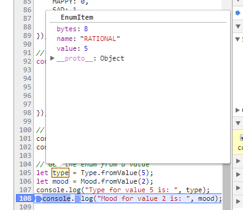

# Why

To improve readability and to better understand the contents of a variable during debugging.

Enums are usually a mapping from a string representation to an integer representation. 
For example, the opengl constant _gl.UNSIGNED_BYTE_ has the integer value _5121_.
During debugging or logging of the variable, all you see is the integer _5121_ which isn't very helpful.
The aim of this small project is to assign meaningful values that allow you to make sense of variable values 
at runtime.



To run the example enter: ```node --experimental-modules example.mjs```

# Usage

```javascript

// create enum from a classic list of integer assignment
const Mood = new Enum({
	HAPPY: 0,
	SAD: 1,
	EXCITED: 2,
	BORED: 3
});

// create enum with additional properties for each entry. "value" is mandatory.
const Type = new Enum({
	BYTE: {value: 1, bytes: 1},
	ASCII: {value: 2, bytes: 1},
	SHORT: {value: 3, bytes: 2},
	LONG: {value: 4, bytes: 4},
	RATIONAL: {value: 5, bytes: 8},
});

// Enum values have a meaningful string representation 
console.log(Type.BYTE);  // 'Enum(name: BYTE, value: 1, bytes: 1)'
console.log(Mood.HAPPY); // 'Enum(name: HAPPY, value: 0)'

// Get the enum from a value
let type = Type.fromValue(5);
let mood = Mood.fromValue(2);
console.log("Type for value 5 is: ", type);
console.log("Mood for value 2 is: ", mood);

// iterate over the entries of the enum:
for(let entry of Type.entries){
	console.log(entry);
}

```
